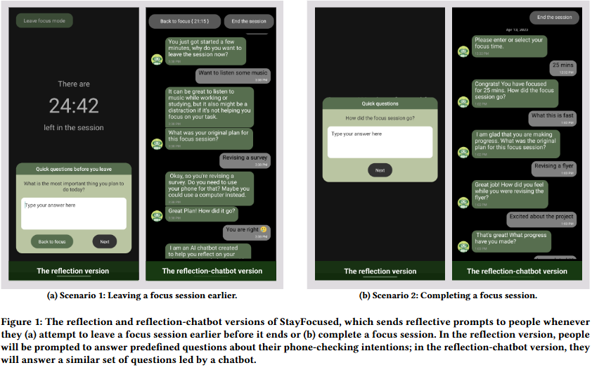

## StayFocused [📎[chi-24 full paper](https://yuhanlolo.github.io/me/papers/chi24-stayfocused-li.pdf) & 📎[cui-23 poster](https://yuhanlolo.github.io/me/papers/cui23-ea-li.pdf)]
This repo includes the three different versions (i.e., baseline, reflection, and reflection-chatbot) of StayFocused, a time-management mobile app. StayFocused helps people focus on their current tasks and reduce compulsive smartphone use by integrating a reflective chatbot. The figure below shows how the reflective chatbot of StayFocused full version reacts in two scenarios: a) leaving the focus session earlier, and b) completing the focus session.
 

**⏱ Introduction of available branches:**
- `Hai/baseline`: baseline version of StayFocused, without reflective prompts and the chatbot;
- `Hai/reflection2`: reflection version of StayFocused, with reflective prompts but without the chatbot;
- `chatbot-reflection`: full version of StayFocused.

**📖 What you need to configure:**
- GPT-apis on the server, and configure the urls in files under `src/gpt_apis` of the `chatbot-reflection` branch;
- Database configurations in `src/api/firebase.ts`.
